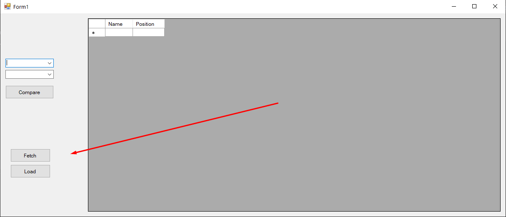

## General

A simple web scraper that allows to track changes of the department teaching staff.
User is able both to load data from earlie fetched local copies of html documents and to fetch data in real time.

## How to use
1. Open a program and click the "Load" button to load data from a local copy

2. Click the "Fetch" button to fetch data in real time

3. Select datetime ranges you wish to compare and click the "Compare" button

4. You are able to see changes of selected copies of teaching stuff.

Each change in teaching stuff has an own color.
#### Red
Red row means that teacher is no longer a member of teaching stuff.
#### Green
Green row means that teacher becomes a member of teaching stuff.
#### Blue
Blue cell means that the teacher position has been updated.

## Remarks
For testing purposes a sample file (**2022-01-04 15-43-40.html**) was created.
It contains untruth data and was used only for demonstrating program functionality.

Restarting a program will not lead to data loss, because it's stored in local sqlite database file.